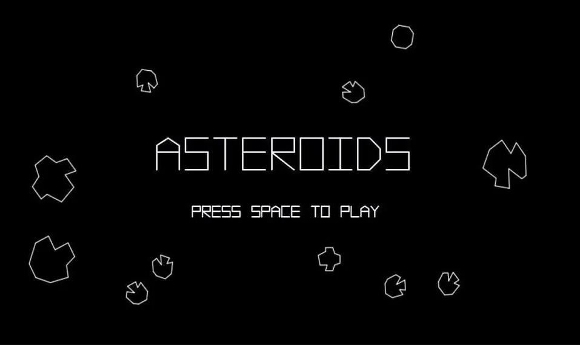

# ASTÉROÏDS

Le projet a pour objectif de réaliser le célèbre jeu Astéroïds.
Le code est réalisé en C++ et utilise la librairie SFML.

## Table des Matières

- [Introduction](#introduction)
- [Explication du projet](#Explication-du-projet)
- [Définition des termes](#Définition-des-termes)
- [Getting Started](#getting-started)
  - [Prerequisites](#prerequisites)
  - [Installation](#installation)
- [Remerciement](#remerciement)

## Introduction

Description succinte du projet

## Features

Point clé du projet :

- Feature 1
- Feature 2
- ...

## Définition des termes

Afin de faire un code cohérent et construit il faut se mettre d'accord sur la nomenclature.

Objets :
- vaisseau
- asteroide
- tir

## Getting Started

Comment lancer le jeu et utiliser le code

### Prerequisites

Liste des installations prérequises pour le bon fonctionnement.

